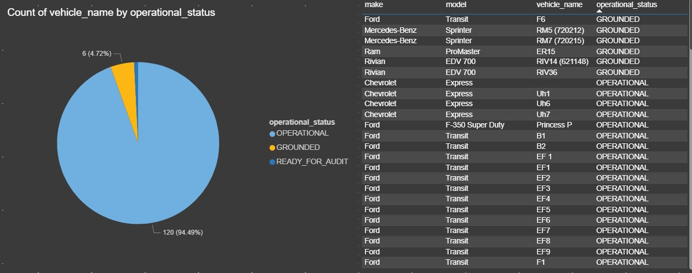
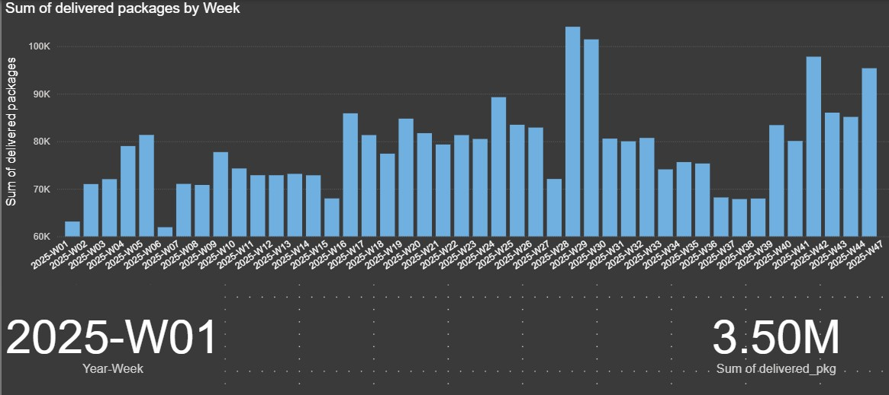
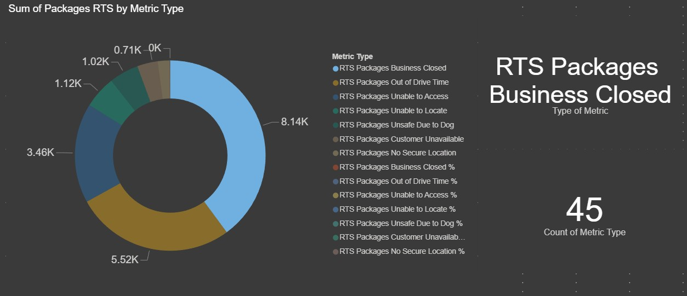
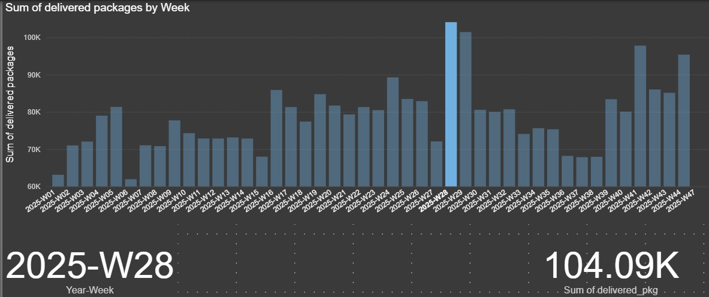
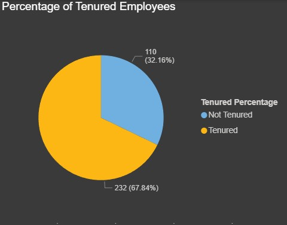

# DSP Data Pipeline & Analytics

A comprehensive data pipeline solution for collecting, ingesting, and analyzing delivery service partner (DSP) driver and fleet data. This system aggregates real-time operational metrics from multiple data sources into a unified analytics platform.

## 📋 Table of Contents

- [Overview](#overview)
- [Architecture](#architecture)
- [Tech Stack](#tech-stack)
- [Data Ingestion](#data-ingestion)
- [Database Schema](#database-schema)
- [Setup & Installation](#setup--installation)
- [Usage](#usage)
- [Power BI Dashboard Examples](#power-bi-dashboard-examples)
- [Key Features](#key-features)

---

## Overview

This project implements an end-to-end data pipeline designed to:

- **Collect** operational data from multiple delivery and fleet management systems
- **Normalize** heterogeneous data formats (CSV, Excel, APIs) into consistent schemas
- **Ingest** processed data into Azure SQL Server with deduplication and data quality checks
- **Analyze** performance metrics through pre-built aggregations and views
- **Visualize** insights using Power BI dashboards

The pipeline handles complex business logic including duplicate detection, data validation, and transformation rules specific to delivery operations.

---

## Architecture

### High-Level Data Flow

```
Data Sources (Excel, APIs, CSV)
        ↓
Python Ingestion Scripts
        ↓
Data Normalization & Validation
        ↓
Azure SQL Server Database
        ↓
Analytics & Aggregations
        ↓
Power BI Dashboards
```

### System Components

| Component | Purpose |
|-----------|---------|
| **Ingestion Layer** | Python-based ETL scripts for data extraction and transformation |
| **Database Layer** | Azure SQL Server with carefully designed schema and constraints |
| **Analytics Layer** | SQL views and aggregations for business metrics |
| **Presentation** | Power BI dashboards for stakeholder consumption |

---

## Tech Stack

- **Language:** Python 3.x
- **Database:** Microsoft Azure SQL Server
- **ORM/Driver:** pyodbc (ODBC Driver 18 for SQL Server)
- **Data Processing:** Pandas, NumPy
- **Authentication:** Azure Identity, SQL authentication
- **Environment Management:** python-dotenv
- **Analytics & Visualization:** Power BI
- **Infrastructure:** Azure Cloud

---

## Data Ingestion

### Overview

The ingestion system is modular and designed to handle multiple data sources independently. Each ingestion script follows a consistent pattern:

1. **Source Data Reading** → Parse input format (Excel, CSV, API response)
2. **Data Normalization** → Standardize column names, formats, and data types
3. **Validation** → Apply business rules and data quality checks
4. **Deduplication** → Detect and prevent duplicate records
5. **Database Insert** → Bulk insert with error handling and fallback strategies

### Ingestion Scripts

#### 1. **ingest_all_files.py** (Main Orchestrator)
Comprehensive ingestion pipeline that processes multiple data sources in sequence.

**Responsibilities:**
- Coordinates ingestion of multiple data streams
- Manages environment configuration
- Handles database connections and transactions
- Implements bulk insert strategies with fallback mechanisms

**Key Functions:**
- `_req(key)` - Retrieve required environment variables with validation
- `to_null(x)` - Normalize null-like values ("", "NULL", "N/A", etc.)
- `to_int(x)` - Safe integer conversion with null handling
- `to_decimal(x, places)` - Decimal conversion with rounding
- `fast_insert(cursor, sql, rows)` - Bulk insert with auto-fallback to row-by-row on failure

#### 2. **ingest_backlog_itineraries.py** (Backlog Itineraries)
Specialized ingestion for driver itinerary backlogs from Excel files.

**Features:**
- Parses Excel workbooks with flexible column name mapping
- Handles date/time parsing with fixed 23:00:00 timestamp
- Splits multi-route entries into separate database rows
- Applies route code validation and station code derivation

**Usage:**
```bash
python ingest_backlog_itineraries.py --excel /path/to/backlog_itineraries.xlsx
```

**Key Transformations:**
- Date normalization to ISO format with 23:00:00 time
- Transporter ID validation and truncation (configurable)
- Route code enforcement (max 32 characters with truncate strategy)
- Station code derivation: "IS" prefix → "dsw2", otherwise → "dsw3"

#### 3. **revenue_management/** (Revenue Tracking)
Subdirectory containing revenue-related ingestion scripts.

**Files:**
- `ingest_revenue_values.py` - Parse and ingest revenue figures
- `weekly_revenue_job.py` - Scheduled revenue aggregation job

**Purpose:** Tracks delivery partner revenue and financial metrics for business analysis.

#### 4. **sql_creation/** (Schema Initialization)
Database schema setup and table creation utilities.

**Files:**
- `create_tables.sql` - T-SQL script for complete schema
- `create_tables_only.py` - Python wrapper for local SQL Server
- `create_tables_only_azure.py` - Azure SQL Server variant with special authentication

---

## Database Schema

### Core Tables

#### **dsp.Associate** (People Master)
Master table for drivers and delivery associates.

```sql
transporter_id (PK)     -- Natural key, VARCHAR(16)
full_name              -- Driver name
position_title         -- Job role
qualifications         -- Certifications/skills
id_expiration_date     -- License/cert expiration
personal_phone         -- Contact info
work_phone
email
working_status         -- Active/Inactive status
```

#### **dsp.Itineraries** (Real-Time Snapshots)
Daily delivery itineraries with operational metrics.

```sql
itin_row_id (PK)              -- Identity column
file_datetime                 -- Snapshot timestamp (normalized to seconds)
transporter_id (FK)           -- References Associate
driver_name                   -- Denormalized for quick access
route_code                    -- Route identifier
progress_status               -- Current delivery status
projected_rts                 -- Projected return to station (minutes)
projected_ot_min              -- Projected overtime
all_stops / stops_complete    -- Stop tracking
total_packages                -- Package count
cortex_avg_pace_sph           -- Packages per hour pace
cortex_remaining_soc          -- Vehicle state of charge
app_sign_in/out_time          -- Driver app activity
station_code                  -- Derived station identifier
row_sig                       -- Persisted SHA2 hash for deduplication
```

**Deduplication:** Composite unique index on `(file_datetime, transporter_id, route_code)` with `IGNORE_DUP_KEY` option prevents duplicate inserts without errors.

#### **dsp.Routes** (Route Snapshots)
Route-level operational data.

```sql
route_row_id (PK)
snapshot_dt
route_code
dsp_name
transporter_id (FK)
route_progress
all_stops / stops_complete
```

#### **dsp.NetradyneEvents** (Safety Events)
Vehicle safety and compliance events from Netradyne camera systems.

```sql
event_row_id (PK)
event_date
delivery_associate
transporter_id (FK)
metric_type          -- Speeding, seatbelt, distraction, etc.
metric_subtype       -- Granular categorization
video_link           -- Reference to recorded incident
review_details       -- Safety review notes
```

#### **dsp.FleetVehicles** (Vehicle Master)
Fleet vehicle registry with operational and compliance data.

```sql
vehicle_id (PK)
vin (UNIQUE)        -- Vehicle identification number
service_type        -- Standard, Prime, etc.
make / model / year
vehicle_status      -- Operational status
operational_status  -- Ready/Maintenance/Out of Service
ownership_type      -- Owned/Leased/Subcontractor
ownership_start/end -- Tenure tracking
registration_expiry
station_code
payload / cubic_capacity
```

#### **dsp.DailyScorecard** (Daily Metrics)
Per-driver daily performance scorecard.

```sql
week_label
delivery_associate_name
delivered_packages
packages_dnr              -- Did Not Reach
dsb_count / dsb_dpmo      -- Damage/Safety/Breakage metrics
rts_percent / rts_dpmo    -- Return to Sender
```

#### **dsp.WeeklyScorecard** (Weekly Metrics)
Comprehensive weekly performance scoring with tiered metrics.

```sql
year_week_label
delivery_associate_name
transporter_id (FK)
overall_score
-- Safety Metrics
fico_score / tier
speeding_event_rate / score
seatbelt_off_rate / score
distractions_rate / score
-- Delivery Metrics
dcr_metric / tier          -- Delivery Cost Ratio
dsb_metric / dpmo_score    -- Damage/Safety/Breakage
pod_metric / score         -- Proof of Delivery
-- Financial
packages_delivered
```

#### **dsp.StationLevelMetrics*** (Aggregated Metrics)
Station-wide daily and weekly aggregations.

```sql
Daily:
  metric_date
  dsp_code
  dispatched_pkg / delivered_pkg
  dnr / rts_percent
  
Weekly:
  iso_year_week
  dsp_code
  [same metrics as daily]
```

#### **dsp.WST_*** (Warehouse/Station Tables)
Detailed operational reports from warehouse systems.

- **WST_DeliveredPackages** - Package delivery counts by type
- **WST_ServiceDetails** - Service duration and distance metrics
- **WST_UnplannedDelay** - Delay incidents and root causes
- **WST_WeeklyReport** - Consolidated weekly service metrics

### Data Quality Features

**Duplicate Prevention:**
- SHA2_256 hash computed from key columns
- UNIQUE INDEX with IGNORE_DUP_KEY prevents duplicate errors
- One-time cleanup of existing duplicates on schema upgrade

**Referential Integrity:**
- Foreign keys from Itineraries, Routes, etc. to Associate table
- NOT NULL constraints on critical fields (transporter_id, file_datetime)
- CHECK constraints for data validation

**Defensive Hashing:**
```sql
row_sig AS CONVERT(VARBINARY(32), 
  HASHBYTES('SHA2_256',
    CONCAT(file_datetime, '|', transporter_id, '|', route_code)
  )
) PERSISTED
```

---

## Setup & Installation

### Prerequisites

- Python 3.8+
- Azure subscription with SQL Server instance
- ODBC Driver 18 for SQL Server installed locally
- Network connectivity to Azure SQL Server

### Environment Configuration

1. **Copy environment template:**
   ```bash
   cp Backend/env.sample Backend/.env
   ```

2. **Configure connection parameters in `.env`:**
   ```env
   # Azure SQL Connection
   SQLSERVER_HOST=tcp:your-server.database.windows.net
   SQLSERVER_PORT=1433
   SQLSERVER_DATABASE=your-database-name
   SQLSERVER_USER=your-username
   SQLSERVER_PASSWORD=your-password
   SQLSERVER_DRIVER=ODBC Driver 18 for SQL Server
   SQLSERVER_ENCRYPT=yes
   SQLSERVER_TRUSTSERVERCERTIFICATE=no
   SQLSERVER_TIMEOUT=30
   
   # Optional: Azure AD Authentication (Service Principal)
   SQLSERVER_AUTHENTICATION=ActiveDirectoryAccessToken
   AZURE_TENANT_ID=your-tenant-id
   AZURE_CLIENT_ID=your-client-id
   AZURE_CLIENT_SECRET=your-client-secret
   
   # Ingestion Settings
   TRANSPORTER_ID_MAXLEN=64
   TRANSPORTER_ID_STRATEGY=truncate  # or 'error'
   ROUTE_CODE_MAXLEN=32
   ROUTE_CODE_STRATEGY=truncate
   DEBUG=no
   ```

3. **Install dependencies:**
   ```bash
   cd Backend
   pip install -r requirements.txt
   ```

### Database Schema Initialization

1. **For Azure SQL Server:**
   ```bash
   python Backend/Ingestion/sql_creation/create_tables_only_azure.py
   ```

2. **For Local SQL Server:**
   ```bash
   python Backend/Ingestion/sql_creation/create_tables_only.py
   ```

3. **Or execute SQL directly:**
   - Run `Backend/Ingestion/sql_creation/create_tables.sql` in SQL Server Management Studio
   - Schema creation is idempotent; safe to re-run

---

## Usage

### Basic Data Ingestion

**Ingest backlog itineraries:**
```bash
python Backend/Ingestion/ingest_backlog_itineraries.py \
  --excel data/backlog_itineraries_2025-06-18.xlsx
```

**Output:**
```
Inserted 450 itinerary rows.
```

### Ingestion with Debug Output

Enable detailed logging to troubleshoot data transformations:

```bash
DEBUG=yes python Backend/Ingestion/ingest_backlog_itineraries.py \
  --excel data/backlog_itineraries.xlsx
```

This will output:
- Row counts before/after filtering
- Truncation warnings for oversized fields
- Example rows being inserted (JSON format)
- Detailed error information with row indices

### Handling Large Files

The ingestion system automatically adapts to file size:

```python
# Fast bulk insert (first attempt)
cursor.fast_executemany = True
cursor.executemany(sql, rows)

# Falls back to row-by-row on error
for row in rows:
    cursor.execute(sql, row)
```

This ensures reliability even with connection timeouts or large datasets.

---

## Power BI Dashboard Examples

The analytics platform delivers actionable insights through interactive Power BI dashboards. Below are representative examples showcasing key performance areas and metrics.

### 📊 Dashboard Galleries

#### **Fleet Status Dashboard**
Real-time operational overview of the entire fleet with vehicle-level metrics and performance indicators.



**Key Metrics:**
- Active vs. inactive vehicle counts
- Vehicle utilization rates
- Service type distribution
- Operational status breakdown
- Real-time dispatch tracking

**Use Cases:**
- Monitor fleet availability for demand planning
- Identify maintenance scheduling opportunities
- Track vehicle deployment efficiency

---

#### **Total Packages Dashboard**
Comprehensive package delivery volume analytics with temporal trends and operational insights.



**Key Metrics:**
- Daily and weekly package delivery volumes
- Trend analysis and forecasting
- Volume distribution by station and service type
- Peak delivery period identification
- Historical performance comparisons

**Use Cases:**
- Capacity planning and staffing decisions
- Identify seasonal patterns and anomalies
- Benchmark performance across stations

---

#### **Not Delivered Packages Dashboard**
Detailed analysis of failed deliveries with root cause categorization and improvement tracking.



**Key Metrics:**
- DNR (Did Not Reach) package counts
- Failure reason distribution
- Repeat failure patterns by driver/route
- Impact on customer satisfaction
- Resolution tracking

**Use Cases:**
- Identify operational bottlenecks
- Target coaching and training initiatives
- Monitor service quality improvements

---

#### **Specific Week Packages Dashboard**
Weekly performance snapshot with granular visibility into daily delivery metrics and trends.



**Key Metrics:**
- Daily delivery counts for selected week
- Day-over-day performance changes
- Weekly targets vs. actuals
- Driver and route performance rankings
- Exception identification and alerts

**Use Cases:**
- Weekly performance reviews and coaching
- Quickly spot underperforming days/routes
- Adjust staffing for upcoming week

---

#### **Tenured Employees Dashboard**
Workforce analytics focused on tenure, retention, and employee lifecycle tracking.



**Key Metrics:**
- Employee tenure distribution
- Retention rates by tenure bracket
- Hiring and attrition trends
- Performance correlation with tenure
- Succession planning insights

**Use Cases:**
- Identify high-value long-term employees
- Monitor workforce stability
- Plan retention initiatives
- Support succession planning

---

### 📈 Dashboard Features

**Interactive Filtering:**
- Drill-down by station, DSP, driver, or date range
- Cross-filter linked visualizations
- Dynamic date period selection

**Real-Time Data:**
- Automated refresh every 30 minutes
- Direct connection to Azure SQL database
- Minimal latency for operational dashboards

**Mobile-Responsive Design:**
- Optimized for desktop and tablet viewing
- Touch-friendly navigation and filters
- Responsive layouts for different screen sizes

**Accessibility & Sharing:**
- Role-based access via Azure AD
- Email distribution for scheduled reports
- Export capabilities (Excel, PDF)

---

## Key Features

### 🔄 Robust Data Normalization
- Flexible null handling (treats "", "NULL", "N/A", etc. consistently)
- Safe type conversions with fallback to None
- Decimal precision control with rounding
- Date/time parsing with fuzzy matching

### 🛡️ Data Quality & Deduplication
- Persisted hash-based deduplication
- Automatic duplicate detection before insert
- Foreign key constraints for referential integrity
- NOT NULL and CHECK constraints for data validation

### ⚡ High-Performance Ingestion
- Bulk insert optimization with pyodbc
- Automatic fallback for connection failures
- Configurable batch strategies
- Debug mode for troubleshooting

### 🔐 Enterprise Security
- Azure AD authentication support
- Environment-based credential management
- No hardcoded secrets
- Encrypted database connections (TLS)

### 📊 Rich Analytics & Visualization
- Pre-built aggregation views
- Weekly scorecard calculations
- Station-level metrics rollups
- Interactive Power BI dashboards with drill-down capability
- Customizable metric definitions

### 🏗️ Modular Architecture
- Separate scripts for different data sources
- Reusable utility functions (type conversions, null handling)
- Extensible for new data sources
- Clear separation of concerns

---

## File Structure

```
DSP-Data-pipeline-and-Analytics/
├── Backend/
│   ├── .env.example                 # Environment variable template
│   ├── env.sample                   # Alternative config template
│   ├── requirements.txt             # Python dependencies
│   │
│   ├── Ingestion/
│   │   ├── ingest_all_files.py     # Main orchestrator
│   │   ├── ingest_backlog_itineraries.py  # Backlog processing
│   │   ├── blankenv.txt            # Blank environment template
│   │   │
│   │   ├── revenue_management/
│   │   │   ├── ingest_revenue_values.py
│   │   │   └── weekly_revenue_job.py
│   │   │
│   │   └── sql_creation/
│   │       ├── create_tables.sql    # Main schema (T-SQL)
│   │       ├── create_tables_only.py
│   │       └── create_tables_only_azure.py
│   │
│   └── schema/
│       ├── Prediction_for_scorecard.sql
│       ├── revenue_log_schema.sql
│       ├── scorecard_policy.sql
│       ├── week_pointer_schema.sql
│       ├── weeklyProjectedScore.sql
│       ├── TenureReporting/        # Tenure tracking schemas
│       └── [19 additional SQL files for analytics views]
│
├── PowerBI-examples/                # Dashboard showcase images
│   ├── FleetStatus.jpg
│   ├── TotalPkgs.jpg
│   ├── NotDeliveredPkgs.jpg
│   ├── SpecificWeekPkgs.jpg
│   └── TenuredEmployees.jpg
│
└── README.md                        # This file
```

---

## Development & Contributions

### Running Tests

Data validation occurs during ingestion with detailed error reporting:

```bash
DEBUG=yes python Backend/Ingestion/ingest_backlog_itineraries.py --excel test_data.xlsx
```

### Extending the Pipeline

To add a new data source:

1. Create a new Python script in `Backend/Ingestion/`
2. Implement required functions:
   - `normalize_headers()` - Column mapping
   - `validate_row()` - Data quality checks
   - `transform_row()` - Type conversions
   - `insert_data()` - Database insertion
3. Follow the existing error handling pattern
4. Add documentation to this README

---

## Troubleshooting

### Connection Issues

**Error: "ODBC Driver 18 for SQL Server not found"**
- Install ODBC Driver 18: https://learn.microsoft.com/en-us/sql/connect/odbc/download-odbc-driver-for-sql-server

**Error: "Login failed for user"**
- Verify credentials in `.env`
- Ensure firewall rules allow your IP on Azure SQL Server

**Error: "Connection timeout"**
- Check network connectivity to Azure SQL Server
- Increase `SQLSERVER_TIMEOUT` in `.env` (default 30 seconds)

### Data Issues

**Error: "Row length exceeds max for transporter_id"**
- Set `TRANSPORTER_ID_STRATEGY=truncate` in `.env`
- Or increase `TRANSPORTER_ID_MAXLEN` (requires schema change)

**Error: "Duplicate insert failed"**
- Check debug output: `DEBUG=yes python ingest_*.py`
- Verify data uniqueness on (file_datetime, transporter_id, route_code)

---

## Performance Metrics

### Typical Ingestion Performance

| Operation | Time | Records |
|-----------|------|---------|
| Parse Excel file | 2-5s | 500-1000 rows |
| Normalize & validate | 1-3s | 500-1000 rows |
| Bulk insert | 1-2s | 500-1000 rows |
| **Total** | **4-10s** | **500-1000 rows** |

### Database Query Performance

- Associate master: < 10ms (indexed on transporter_id)
- Daily itinerary retrieval: < 50ms (indexed on file_datetime)
- Weekly aggregations: 1-5s (depends on date range)

---

## Future Enhancements

- [ ] Real-time streaming ingestion via Azure Event Hubs
- [ ] Machine learning pipeline for anomaly detection
- [ ] Automated data quality monitoring and alerting
- [ ] API endpoint for Power BI DirectQuery
- [ ] Incremental refresh optimization for large tables
- [ ] Data lineage and audit trail
- [ ] Integration with Slack/Teams notifications

---

**Last Updated:** June 2026  
**Version:** 1.1.0
